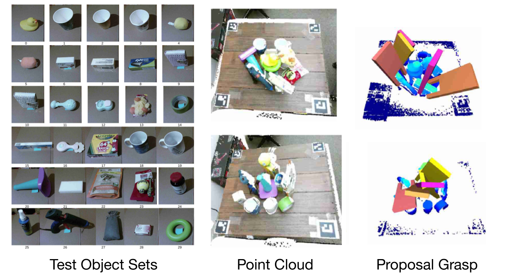
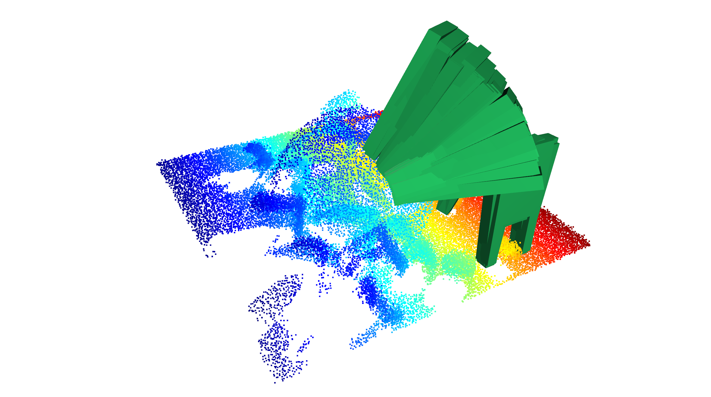

# S4G: Amodal Single-view Single-Shot SE(3) Grasp Detection in Cluttered Scenes

[[Project Page]](https://sites.google.com/view/s4ggrapsing) [[Paper]](https://arxiv.org/abs/1910.14218) [[Video]](https://www.youtube.com/watch?v=Xlq4nw2AGcY)

This repo contains code for S4G (CoRL 2019). 
S4G is a grasping proposal algorithm to regress SE(3) pose from single camera 
point cloud(depth only, no RGB information). 
S4G is trained **only** on synthetic dataset with [YCB Objects](http://ycb-benchmarks.s3-website-us-east-1.amazonaws.com/),
it can generate to real world grasping with **unseen** objects that has never been used in the training. 

It contains both `training data generation code` and `inference code` We also provide the `pretrained model` for fast trail with our S4G. 


## Installation
1. Install the MuJoCo. It is recommended to use conda to manage python package:

Install MuJoCo from: http://www.mujoco.org/ and put your MuJoCo licence to your install directory. If you already have
MuJoCo on your computer, please skip this step.

2. Install Python dependencies. It is recommended to create a conda env with all the Python dependencies.

```bash
git clone https://github.com/yzqin/s4g-release
cd s4g-release
pip install -r requirements.txt # python >= 3.6
```

3. The file structure is listed as follows:

`data_gen`: training data generation
`data_gen/mujoco`: random scene generation
`data_gen/pcd_classes`: main classes to generate antipodal grasp and scores (training label)
`data_gen/render`: render viewed point cloud for generated random scene (training input)

`inference`: training and inference
`inference/grasp_proposal`: main entry

4. Build PointNet CUDA Utils, need nvcc(CUDA compiler) >=10.0
```bash
cd s4g-release/inference/grasp_proposal/network_models/models/pointnet2_utils
python setup.py build_ext --inplace
```

5. Try the minimal S4G with pretrained code:
```bash
cd s4g-release/inference/grasp_proposal
python grasp_proposal_test.py
```

It will predict the grasp pose based on the point cloud from 2638_view_0.p and visualize
the scene and the predicted grasp poses. Note that many tricks, e.g. NMS, are not used in this minimal example

You will see something like that if it all the setup work:


6. More details on the grasp proposal (inference time):
You can refer to [grasp_detector](inference/grasp_proposal/grasp_detector.py) for more details of how to 
pre-process and post-process the data during inference.

7. More details on training data and training
Data generation contains several steps: 
Random Scene Generation, Viewed Point Rendering, Scene(Complete) Point Generation, Grasp Pose Searching, Grasp Pose Post Processing
For more details, you can refer to the directory of [data_gen](data_gen).

## Bibtex

```
@inproceedings{qin2020s4g,
  title={S4g: Amodal Single-View Single-Shot SE(3) Grasp Detection in Cluttered Scenes},
  author={Qin, Yuzhe and Chen, Rui and Zhu, Hao and Song, Meng and Xu, Jing and Su, Hao},
  booktitle={Conference on Robot Learning},
  pages={53--65},
  year={2020},
  organization={PMLR}
}
```

## Acknowledgement
Some file in this repository is based on the wonderful projects
from [GPD](https://github.com/atenpas/gpd) and [PointNet-GPD](https://github.com/lianghongzhuo/PointNetGPD). 
Thanks for authors of these projects to open source their code!


